# Climate Analogs

**Analyses to identify climate analogs and implement climate-analog impact models**

This repository contains dual implementations (R and Julia) for identifying climate analogs using Mahalanobis distance and applying them to predict vegetation shifts under climate change.

---

## Table of Contents

* [Overview](#overview)
* [Project Workflow](#project-workflow)
* [File Structure](#file-structure)
* [Key Variables & Concepts](#key-variables--concepts)
* [Core Functions](#core-functions)
* [Dependencies](#dependencies)
* [Usage Examples](#usage-examples)

---

## Overview

**Reverse climate analogs** are geographic locations that currently experience climate conditions similar to what a focal location will experience under future climate change. Forward analogs are the opposite. This project:

1. **Calculates climate dissimilarity** from a focal location and its future climate to the contemporary climate mean of surrounding analog candidates using Mahalanobis distance (MD) transformed to sigma (σ) values
2. **Identifies the best analogs** from a contemporary climate pool
3. **Predicts future impacts** (e.g., vegetation shifts) by extracting vegetation at analog locations

## Project Workflow

---

## File Structure

---

## Key Variables & Concepts

### Climate Data Variables
- **`focal_data_cov`** - Stack of future climate data (annual observations) used to calculate covariance matrix for each focal location. Right now this should be a list/vector of dataframes.
- **`focal_data_mean`** - Future climate normals at focal locations as a dataframe
- **`analog_data`/`analog_pool`** - Contemporary climate normals at focal locations as a dataframe
- **`var_names`** - Climate variable names (e.g., tmax, tmin)

### Spatial Variables
- **`x`, `y`** - Geographic coordinates (longitude, latitude) in decimal degrees
- **`f_x`, `f_y`** - Focal point coordinates
- **`a_x`, `a_y`** - Analog point coordinates

### Distance & Similarity Metrics
- **`md`** - Mahalanobis Distance (squared multivariate distance measure)
- **`sigma`** (σ) - Climate dissimilarity metric (0-∞ scale, derived from chi-squared distribution)
  - Lower σ = better analog
  - σ < 2.0 typically considered good match
- **`dist_km`** - Geographic distance between focal and analog points (kilometers)
- **`cov_i`** - Covariance matrix calculated from future climate annuals

### Sampling Parameters
- **`n_analog_pool`** - Size of randomly sampled analog pool (e.g., 1000-10000)
- **`n_analog_use`** - Number of best analogs to retain (e.g., 100-1000)
- **`min_dist`** - Minimum geographic distance filter (km) - excludes nearby points
- **`max_dist`** - Maximum search radius (km or Inf for unlimited)

---

## Source Code

### Main Workflow
- **`climate_analogs.R` OR `climate_analogs.jl`** - These must be run with `source()` or `include()` (respectively) to load all the functions necessary for calculating climate analogs
- **`find_analogs()`** - Function for computing climate analogs. *This should be the only function you need to run to calculate climate analogs*

### Internal Functions

#### Primary functions 
- **`calculate_analogs()`** - Takes an input pixel and computes it’s climate analogs
- **`calculate_analogs_distributed()`** - Runs calculate_analogs() distributed over multiple cores

#### Distance Calculations
- **`calc_mahalanobis()`** - Computes Mahalanobis distance from focal to analog pool
- **`calc_sigma()`** - Converts Mahalanobis distance to sigma (chi-squared transform)
- **`great_circle_distance()`** - Calculates geographic distance using Haversine formula

#### Geographic Utilities
- **`max_distance_coordinates()`** - Creates bounding box at max_dist radius from focal point
- **`create_bitVector()`** - Fast spatial filter to subset analog pool within bounding box

#### Sampling & Filtering
- **`sample_analogs()`** - Random sample of n_analog_pool from filtered data
- **`spatial_partition()`** - Tiles study area for memory-efficient processing
- **`check_memory()`** - Validates available memory vs. required memory

### Post Processing Functions 

#### Vegetation Analysis (R only)

- **`setup_veg_prediction_bps()`** - Takes outputs of the primary analysis, a study area border, a template raster, and the BPS raster to create a clean dataset of every focal pixel, each analog for each focal pixel, and the vegetation group at that pixel.
- **`calculate_top_sigma()`** - Tallies sigma weighted votes and chooses the vegetation group with the most votes.
- **`build_accuracy_stats()`** - Used in the validation process to take vegetation predictions using contemporary normals and annuals to calculate alignment with actual BPS.
- **`rasterize_predicted_veg()`** - Converts predictions to categorical rasters

---

## Dependencies

### R Packages
**Core Data Manipulation:**
- `data.table` - High-performance data frames
- `dplyr` - Data wrangling
- `purrr` - Functional programming tools

**Spatial/GIS:**
- `terra` - Raster and vector spatial data
- `sf` - Simple features for vector data

**Parallel Processing:**
- `future` - Parallel execution backend
- `furrr` - Future-based apply functions
- `progressr` - Progress bars

**Statistics:**
- `caret` - Classification and accuracy metrics
- `scales` - Data rescaling

**Utilities:**
- `tidyr` - Data reshaping
- `tictoc` - Timing/benchmarking

### Julia Packages
**Core Data:**
- `DataFrames` - Tabular data structures
- `DataFramesMeta` - DataFrame macros
- `CSV` - CSV file I/O
- `CodecZlib` - Compression support

**Statistics & Math:**
- `Distributions` - Chi-squared distribution functions
- `Distances` - Mahalanobis distance calculations
- `Statistics` - Basic statistical functions
- `StatsBase` - Extended statistics
- `LinearAlgebra` - Covariance, matrix operations

**Performance:**
- `Base.Threads` - Multi-threading
- `Distributed` - Distributed computing
- `ThreadPools` - Advanced threading (`@bthreads`)
- `Suppressor` - Suppress warning output

**Utilities:**
- `ProgressMeter` - Progress tracking
- `Random` - Random sampling

---

## Usage example

`code/reverse_analogs/tile_script.jl` (or .R) is where primary analysis occured 
(variables were changed as needed for future and 
contemporary analog predictions). This is currently a script that takes a tile_id as input. 
 Please refer to the [Julia CLI manual](https://docs.julialang.org/en/v1/manual/command-line-interface/#cli) 
 or the [RScript manual](https://linux.die.net/man/1/rscript) for other flags, such as setting the 
 number of cores and threads for analysis. It is easy to edit these scripts to run interactively, simply replace any call
 of `ARGS` or `commandArgs()` with the tile number or name of your input identifier. Within the tile script, it uses that tile ID and hard coded paths 
 to obtain rds files created by `code/reverse_analogs/create_wna_pool_reverse_tiles.R`.
 Those rds files are then slightly prepped, and other variables such as the proportion of the landscape to sample, 
 the maximum distance to sample analogs, among others, can be set. 
 The `find_analogs()` function then computes the climate analogs and writes the outputs to your `output_dir`
 named `output_file` as a gzipped CSV (file extension is handled for you).

---

## Reference

**Key Algorithm:** Adapted from Mahony et al. 2017, *Global Change Biology*: https://doi.org/10.1111/gcb.13645